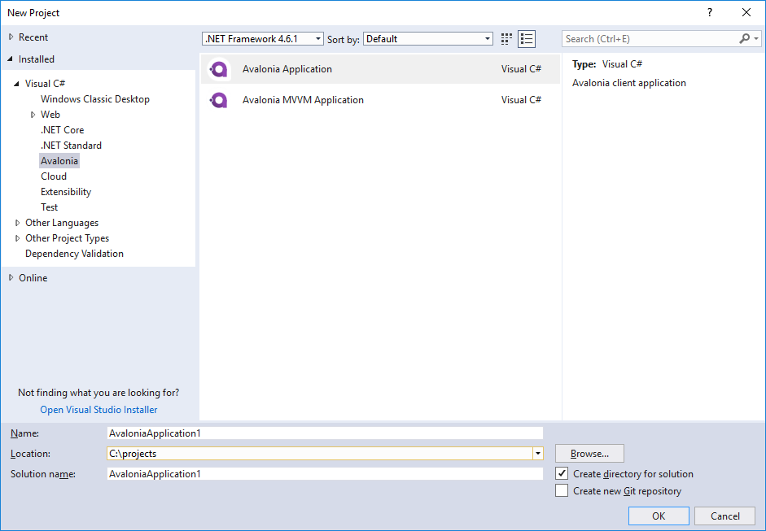

Title: Creating a new Avalonia Project
---
## Visual Studio

The easiest way to get started with Avalonia from Visual Studio is to [install the extension](https://marketplace.visualstudio.com/items?itemName=AvaloniaTeam.AvaloniaforVisualStudio) from the Visual Studio Marketplace.

Installing the extension will add a couple of project templates to Visual Studio, under the `Avalonia` heading. The installed templates are:

- **Avalonia Application**: This will create a barebones Avalonia application
- **Avalonia MVVM Application**: This will create an application that uses the Model-View-ViewModel pattern with [ReactiveUI](https://reactiveui.net/)



By default these application templates will dual-target .NET Framework 4.6.1 and .NET Core 2.0.

Once you have an Avalonia application, two item templates will become available:

- **Window**: Creates a new top-level [`Window`](../guides/controls/window.md)
- **UserControl**: Create a new [`UserControl`](../guides/controls/usercontrol.md)

## .NET Core

To install the Avalonia templates for .NET Core you must first clone the template repostory and load the templates into `dotnet new`
(NuGet packages to do this without cloning the repository coming soon):

```powershell
git clone https://github.com/AvaloniaUI/avalonia-dotnet-templates
dotnet install -i [path-to-repository]
```

This will add a couple of project templates to `dotnet`:

- **`avalonia.app`**: This will create a barebones Avalonia application
- **`avalonia.app.mvvm`**: This will create an application that uses the Model-View-ViewModel pattern with [ReactiveUI](https://reactiveui.net/)

To create a project using the templates use `dotnet new`:

```powershell
dotnet new avalonia.app -o MyApp
```

Where `avalonia.app` is the name of the template to use and `MyApp` is the name of the project to create.

Once you have an Avalonia application, there are two item templates available:

- **`avalonia.window`**: Creates a new top-level [`Window`](../guides/controls/window.md)
- **`avalonia.usercontrol`**: Create a new [`UserControl`](../guides/controls/usercontrol.md)
